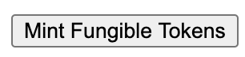
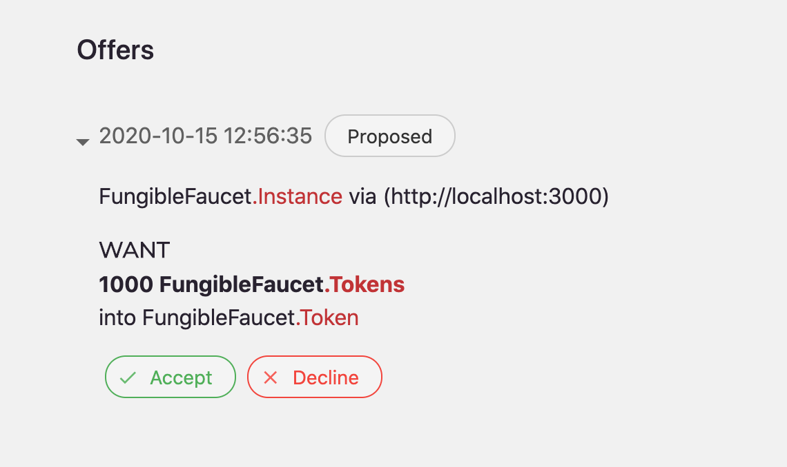
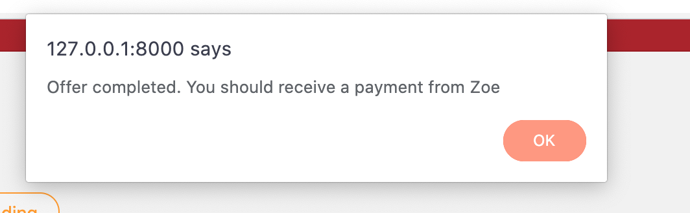
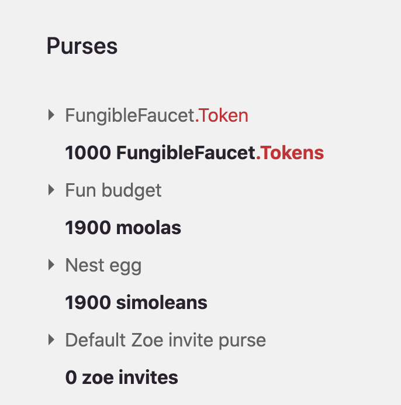

# Fungible Faucet Dapp

TL;DR:

The Fungible Faucet Dapp sends tokens to a user's wallet when they
click the "Mint Fungible Tokens" button.

Install the [prerequisites](https://agoric.com/documentation/getting-started/before-using-agoric.html).

In the parent directory of where you want to put your dapp project, create your own (`my-fungible-faucet` in this example, based on the `dapp-fungible-faucet` repository):
```sh
yarn create @agoric/dapp --dapp-template dapp-fungible-faucet --dapp-branch beta my-fungible-faucet
```

Install and run just like any other NPM application:
```
# Enter the dapp folder
cd my-fungible-faucet
# Install dependencies
yarn install
# Start the Agoric platform with this dapp
yarn start
```

Then navigate to http://127.0.0.1:3000.

The Fungible Faucet Dapp is the simplest [Agoric
Dapp](https://agoric.com/documentation/dapps/). It
demonstrates the three important parts of
a dapp and how they should be connected:
1. the browser UI (the frontend)
2. the API server (the backend)
3. the on-chain contract

This dapp starts a local
blockchain on your computer, and deploys a basic contract to that
blockchain. It does not currently deploy or connect to the Agoric testnet.

This particular dapp UI is written in vanilla JS for simplicity (as
opposed to using a framework).

## Using the Dapp

1. Enter `yarn start:wallet` in your terminal to open the Wallet UI.
2. Navigate a fresh browser tab to http://127.0.0.1:3000 to go to the Dapp UI.
3. Under "Dapps" in the wallet, enable the FungibleFaucet Dapp:


5. Back on the Fungible Faucet page, click the "Mint Fungible Tokens" button.



6. Go back to your wallet and approve the offer stating that you want
   1000 tokens. 

 

7. Once the offer has been approved, your wallet makes an offer to Zoe
   on your behalf, giving you tokens from the `mintPayments` contract.
   You will receive a message that the offer was successful and should
   see the tokens in your purses.

 

 

To learn more about how to build Agoric Dapps, please see the [Dapp Guide](https://agoric.com/documentation/dapps/).

See the [Dapp Deployment Guide](https://github.com/Agoric/agoric-sdk/wiki/Dapp-Deployment-Guide) for how to deploy this Dapp on a public website, such as https://fungiblefaucet.testnet.agoric.com/
